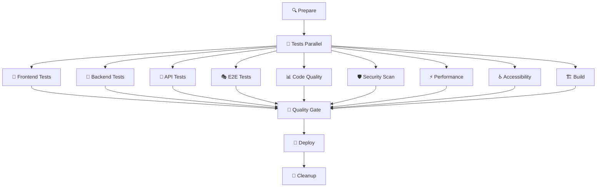
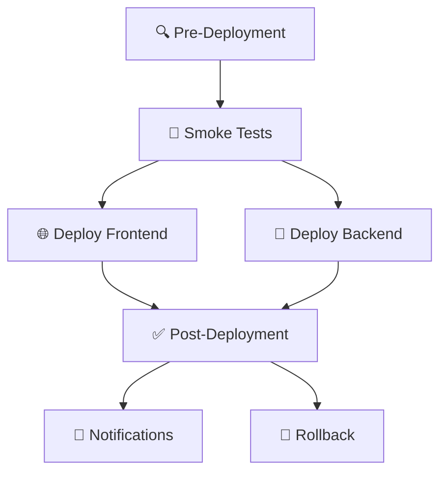

# 🚀 CI/CD Pipeline Documentation

Este directorio contiene la configuración completa del sistema de Integración Continua y Despliegue Continuo (CI/CD) para Olivia Gold.

## 📋 Índice

- [🏗️ Arquitectura del Pipeline](#-arquitectura-del-pipeline)
- [📊 Workflows Disponibles](#-workflows-disponibles)
- [🔧 Configuración](#-configuración)
- [📝 Uso](#-uso)
- [🛠️ Mantenimiento](#-mantenimiento)
- [📊 Métricas y Monitoreo](#-métricas-y-monitoreo)

## 🏗️ Arquitectura del Pipeline

### Pipeline Principal (`ci-cd-optimized.yml`)



### Pipeline de Producción (`deploy-production.yml`)



## 📊 Workflows Disponibles

### 1. **CI/CD Principal** (`ci-cd-optimized.yml`)
- **Triggers**: Push/PR a `main` y `develop`
- **Duración**: ~15-25 minutos
- **Paralelización**: Máxima optimización con jobs paralelos
- **Características**:
  - ✅ Tests en paralelo con matrix strategy
  - 🔄 Cache inteligente de dependencias
  - 📊 Reportes de cobertura automáticos
  - 🛡️ Análisis de seguridad integrado
  - ⚡ Tests de performance con Lighthouse
  - ♿ Validación de accesibilidad
  - 🚦 Quality gates configurables

### 2. **Deploy de Producción** (`deploy-production.yml`)  
- **Triggers**: Releases o dispatch manual
- **Duración**: ~10-15 minutos
- **Características**:
  - 🔍 Validación pre-deployment
  - 🧪 Smoke tests críticos
  - 🚀 Deploy a Vercel + Backend
  - ✅ Validación post-deployment
  - 🔄 Rollback automático en fallos
  - 📢 Notificaciones del equipo

### 3. **Testing Original** (`test.yml`)
- **Estado**: Mantenido para compatibilidad
- **Uso**: Fallback y comparación de performance

## 🔧 Configuración

### Variables de Entorno Requeridas

```bash
# GitHub Secrets necesarios
CODECOV_TOKEN=<token-codecov>
VERCEL_TOKEN=<token-vercel>
VERCEL_ORG_ID=<org-id>
VERCEL_PROJECT_ID=<project-id>
SONAR_TOKEN=<token-sonarcloud>
SNYK_TOKEN=<token-snyk>
DATABASE_URL=<prod-database-url>
FRONTEND_URL=<prod-frontend-url>
BACKEND_URL=<prod-backend-url>
LHCI_GITHUB_APP_TOKEN=<lighthouse-token>
```

### Archivos de Configuración

| Archivo | Propósito | Descripción |
|---------|-----------|-------------|
| `.audit-ci.json` | Seguridad | Configuración de auditoría de vulnerabilidades |
| `lighthouserc.js` | Performance | Configuración de Lighthouse CI |
| `sonar-project.properties` | Calidad | Configuración de SonarCloud |
| `bundlesize.config.json` | Performance | Límites de tamaño de bundles |

### Configuración de Quality Gates

```yaml
# Condiciones críticas (bloquean deploy):
- ✅ Frontend tests passed
- ✅ Backend tests passed  
- ✅ Build successful
- ✅ Security scan clean

# Condiciones de warning (permiten deploy con alerta):
- ⚠️ E2E tests
- ⚠️ Performance tests
- ⚠️ Accessibility tests
```

## 📝 Uso

### 🔄 Desarrollo Normal

```bash
# 1. Crear branch de feature
git checkout -b feature/nueva-funcionalidad

# 2. Hacer cambios y commit
git add .
git commit -m "feat: nueva funcionalidad increíble"

# 3. Push para activar CI
git push origin feature/nueva-funcionalidad

# 4. Crear PR - activa CI completo
```

### 🚀 Deploy a Staging

```bash
# Merge a develop activa deploy automático a staging
git checkout develop
git merge feature/nueva-funcionalidad
git push origin develop
```

### 🌟 Deploy a Producción

```bash
# Opción 1: Via Release
gh release create v1.2.3 --title "v1.2.3" --notes "Nuevas funcionalidades..."

# Opción 2: Manual Dispatch
gh workflow run deploy-production.yml -f version=v1.2.3 -f environment=production
```

### 🛠️ Testing Local de CI

```bash
# Simular tests de CI localmente
npm run test:all
npm run lint
npm run build
npm run test:e2e

# Validar configuraciones
npm run test:api
npx lighthouse-ci autorun
```

## 🛠️ Mantenimiento

### 📊 Monitoreo de Performance

| Métrica | Objetivo | Alerta |
|---------|----------|--------|
| Pipeline Duration | < 25 min | > 30 min |
| Test Success Rate | > 95% | < 90% |
| Build Size | < 250kb | > 300kb |
| Lighthouse Score | > 80 | < 70 |

### 🔄 Mantenimiento Regular

**Semanal:**
- [ ] Revisar y actualizar dependencias
- [ ] Limpiar artifacts antiguos
- [ ] Validar métricas de performance

**Mensual:**  
- [ ] Actualizar versiones de actions
- [ ] Revisar configuración de quality gates
- [ ] Optimizar cache y estrategias de build

**Trimestral:**
- [ ] Audit completo de seguridad
- [ ] Revisión de arquitectura del pipeline
- [ ] Evaluación de nuevas herramientas

### 🚨 Troubleshooting

#### Pipeline Lento
```bash
# Verificar cache hits
echo "Cache status: ${{ steps.cache.outputs.cache-hit }}"

# Analizar dependencias
npm ls --depth=0
npm audit

# Optimizar matrix strategy
# Revisar paralelización de jobs
```

#### Tests Flaky
```bash  
# Ejecutar tests con retry
npm run test:run -- --retry=3

# Analizar logs detallados
npm run test:run -- --reporter=verbose

# Validar E2E stability
npx playwright test --headed --debug
```

#### Deploy Failures
```bash
# Revisar health checks
curl -f $FRONTEND_URL/api/health

# Validar variables de entorno
echo $DATABASE_URL | grep -o '^[^:]*'

# Ejecutar rollback manual
gh workflow run deploy-production.yml -f rollback=true
```

## 📊 Métricas y Monitoreo

### 🎯 KPIs del Pipeline

- **Deployment Frequency**: Diario (objetivo)
- **Lead Time**: < 2 horas desde commit hasta producción  
- **MTTR** (Mean Time to Recovery): < 30 minutos
- **Change Failure Rate**: < 5%

### 📈 Dashboard de Métricas

Las métricas se pueden visualizar en:
- **GitHub Actions**: Duración y éxito de workflows
- **Codecov**: Cobertura de tests
- **SonarCloud**: Calidad de código
- **Lighthouse CI**: Performance web
- **Vercel Analytics**: Métricas de producción

### 🔔 Alertas Configuradas

- ❌ **Pipeline Failure**: Slack + Email al equipo
- ⚠️ **Performance Degradation**: Threshold alerts
- 🔒 **Security Issues**: Inmediata notificación
- 📊 **Coverage Drop**: PR comments automáticos

## 🎨 Personalización

### Agregar Nuevos Tests

```yaml
# En ci-cd-optimized.yml
new-test-job:
  name: 🧪 Nuevo Test
  runs-on: ubuntu-latest
  steps:
    - name: Run New Test
      run: npm run test:nuevo
```

### Configurar Nuevos Environments

```yaml
# Agregar environment en GitHub
# Settings > Environments > New Environment
environment:
  name: staging-v2
  protection_rules:
    - required_reviewers: ['team-lead']
    - wait_timer: 5
```

### Personalizar Quality Gates

```javascript
// En .github/scripts/quality-gate.js
const qualityGate = {
  coverage: { min: 80, critical: 70 },
  performance: { min: 80, critical: 60 },
  security: { max_high: 0, max_critical: 0 }
};
```

---

## 🤝 Contribución

Para contribuir al pipeline:

1. 📖 Leer esta documentación completa
2. 🧪 Probar cambios en branch de feature
3. 📝 Actualizar documentación si necesario
4. ✅ Validar que todos los tests pasan
5. 🔄 Solicitar revisión del equipo DevOps

## 📞 Soporte

- **CI/CD Issues**: GitHub Issues con label `ci/cd`
- **Emergencias de Deploy**: Canal Slack `#deployments`
- **Mejoras de Pipeline**: Discussions en el repo

---

<div align="center">

**🚀 Pipeline optimizado para máxima velocidad y confiabilidad**

_Construido con ❤️ para Olivia Gold_

</div>